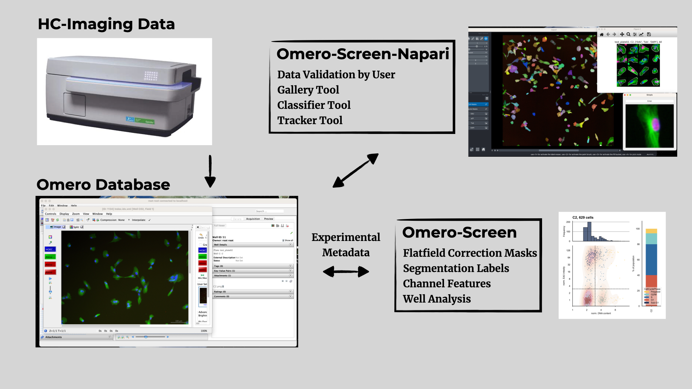

# Program to analyse Omero high-throughput microscopy images

current version 0.1.1
Maintained branch: hpc_version

Our lab uses this program for cell cycle analysis in high content screening format
using data on our omero server.
Additional bug fixes and testing necessary!
Requires a connection to an active Omero server

An outline of the current workflow is shown below:

## Contributors

Robert Zach, Haoran Yue, Alex Herbert and Helfrid Hochegger

## Overview

An end to end pipeline to analyse high-content immuno-fluorescence data.
the software is designed to work with data stored on an Omero server
and handles experimental metadata, flatfield correction, image segmentation and cell cycle analysis,
if EdU labelling was performed.
A separate Napari plugin Omero-Screen-Napari is available to display the data in Napari
and provides further functionality to interact with the data.

## Installation and Usage

Currently only tested on Linux and Mac. Linux installation instruction are not yet available.

For new users with different omero server first generate an omero project called Screens

and use the project ID instead of 5313 in the config.json file (see below, point 3.)

### Installation of Mac with apple silicon chip for Hochegger lab members

1) Clone this repository: git clone
2) Load the cellpose models:

This is best done via the cellpose GUI. However, the M1 compatible cellpose version does not have the GUI functionality of cellpose. To do this follow these steps:

* First make a new environment (conda or venv) Python 3.10 and install cellpose vanilla version via pip install cellpose[gui]
* activate the env and type cellpose in the terminal. This should open the cellpose gui.
* Click on Models -> Add custom torch model to GUI -> load the models from Omero_Screen/data/Cellpose_models.

3) In the data folder make a new folder called secrets that contains a file called config.json. In this file generate a json data structure with the following info:

{

"username": "username",

"password": "password",

"server": "ome2.hpc.sussex.ac.uk",

"project": 5313

}

Note: Use your Sussex Omero username and password here as the json data.

4) Clone cellpose M1 version: To run cellpose on the Mac GPUs, clone or download Peter Sobolewski's adaptation of cellpose from [https://github.com/psobolewskiPhD/cellpose](https://github.com/psobolewskiPhD/cellpose). Clone this into your home directory
5) Make a new conda environment called omero-screen (using the mamba-forge installation of conda)
6) conda install omero-py
7) pip install ~/cellpose # thsi will install the local copy of the M1 compatible cellpose version
8) pip install ezomero pandas scikit-image matplotlib seaborn

activate the environment. You can cd to bin and run omero_screen from the terminal. (To do this, you need to add

export PYTHONPATH=/path to Omero_Screen repo:${PYTHONPATH}

to your .zshrc file.)
